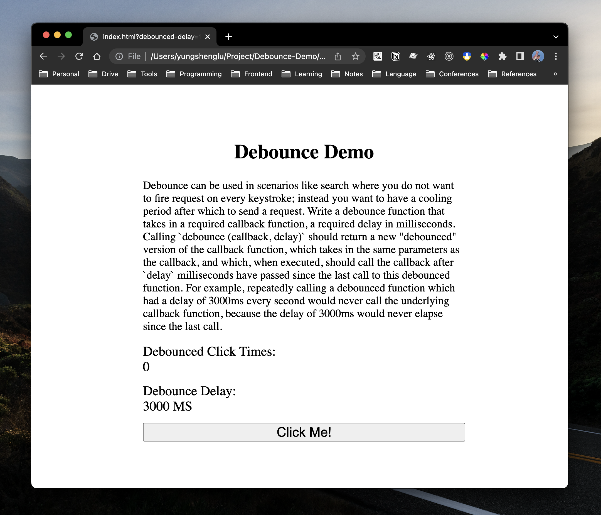

# Debounce Demo in JavaScript



This repository is a simple demo for implementing "Debounce" function in JavaScript. 🚀

> HINT: If you have any questions, please feel free to ask me.

---

## Description

### Execution

1. To run this demo, you need to clone the project first.
  ```bash
  $ git clone https://github.com/yungshenglu/Debounce-Demo
  ```
2. After cloning, change the your current directory into the repository and setup the project
   ```bash
   $ cd Debounce-Demo
   ```
3. Open the file `index.html` via your browser and see our Debounce-Demo

---

## Contributor

> NOTICE: You can follow the contributing process [CONTRIBUTING.md](CONTRIBUTING.md) to join me. I am very welcome for any issue!

- [David Lu](https://github.com/yungshenglu)

---

## License

[WTFPL](LICENSE)